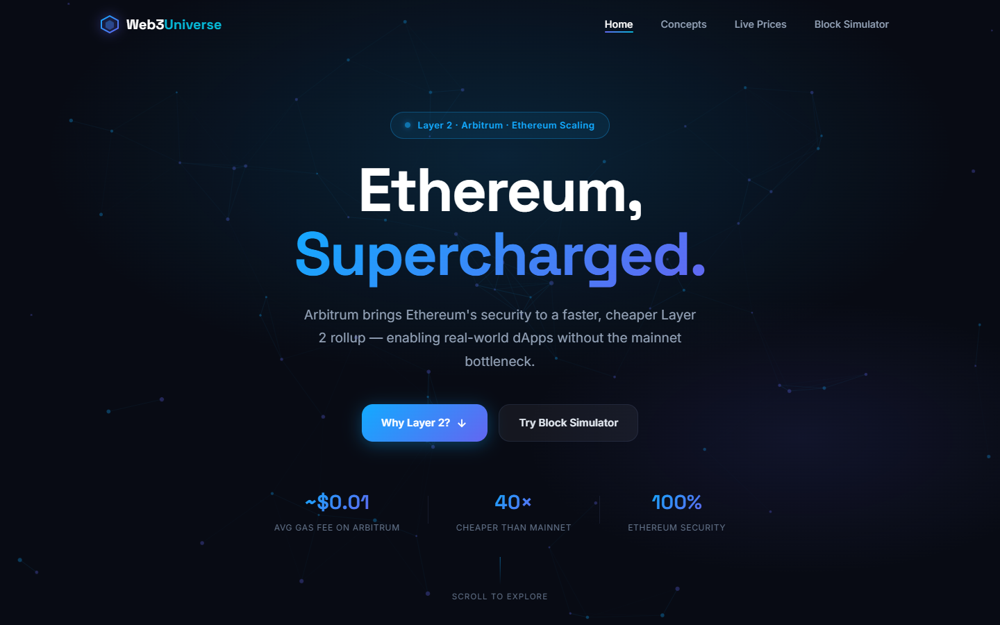
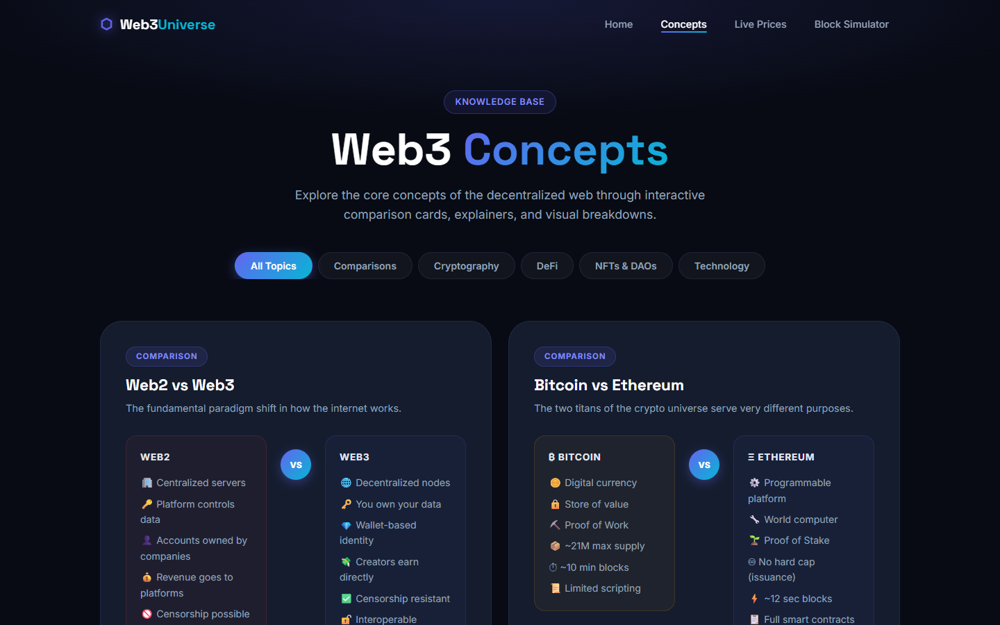
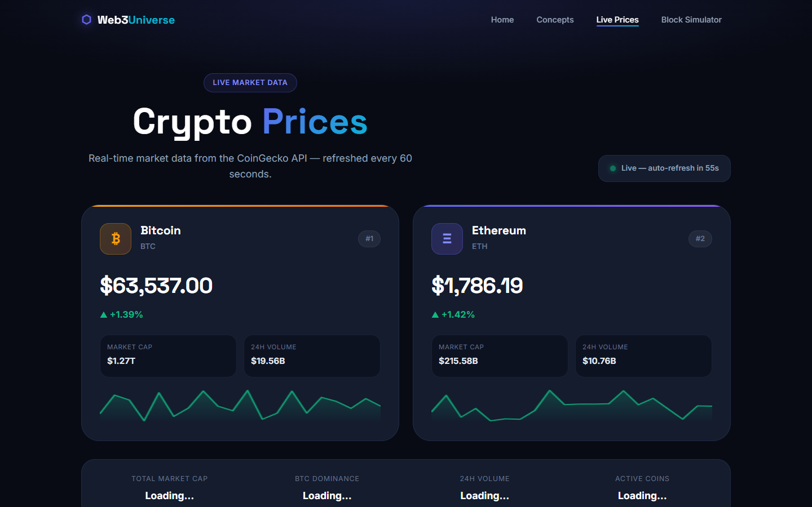
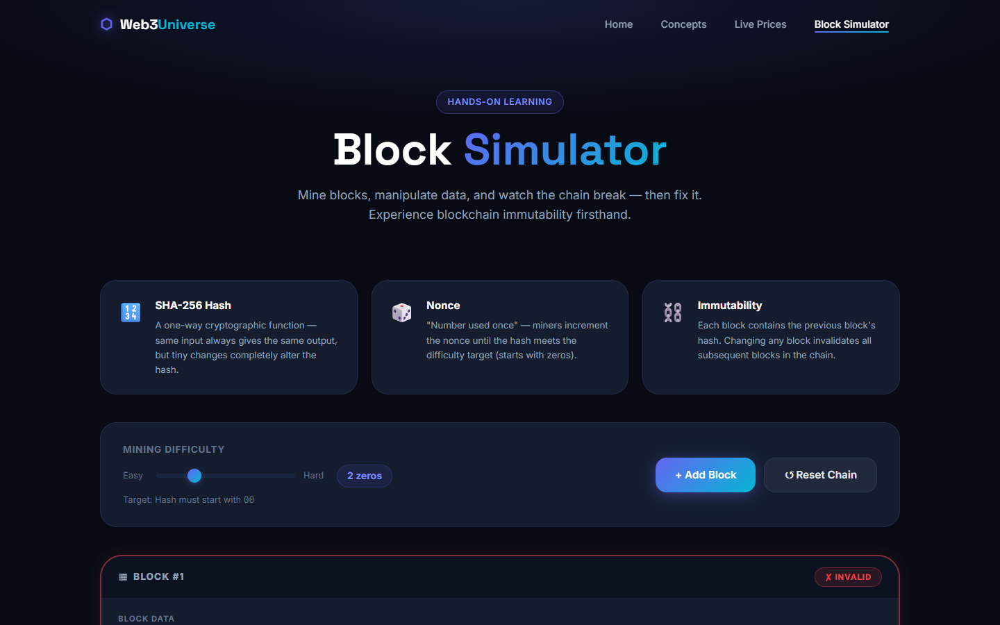

# 🌐 Web3Universe — Arbitrum & Layer 2 Educational Platform

> A fully responsive, interactive Web3 educational website built with pure HTML, CSS, and Vanilla JavaScript — no frameworks, no build tools. Submitted as the **Web3 Foundations Assignment** for MSU BE-III CSE (SFI).

---

## 🚀 Live Pages

| Page | Description |
|------|-------------|
| [`index.html`](index.html) | **Home** — Arbitrum & Layer 2 overview with animated hero, comparison strips, and rollup step diagrams |
| [`concepts.html`](concepts.html) | **Concepts** — 10 interactive visual comparison cards covering Web2 vs Web3, Bitcoin vs Ethereum, DeFi, NFTs, DAOs, smart contracts, and more |
| [`prices.html`](prices.html) | **Live Prices** — Real-time ETH & BTC dashboard powered by the CoinGecko API with auto-refresh and sparkline charts |
| [`simulator.html`](simulator.html) | **Block Simulator** — Hands-on SHA-256 proof-of-work mining simulator with chain immutability, nonce discovery, and a Hash Laboratory |

---

## 📸 Screenshots

### Home Page


### Concepts Page


### Live Prices Page


### Block Simulator Page


---

## ✨ Features

### 🏠 Home Page (`index.html`)
- Animated particle canvas hero with gradient text
- Live stat counters (Arbitrum avg gas fee, 40× cheaper, 100% security)
- Side-by-side Ethereum L1 vs Arbitrum L2 comparison strip
- Visual rollup step diagram (User TX → Batch → L1 Post → Challenge Window)
- Real-world benefit showcase (blockchain gaming micro-transactions)
- Site navigation feature cards

### 🧠 Concepts Page (`concepts.html`)
- **10 concept cards** with filterable categories: Comparisons, Cryptography, DeFi, NFTs & DAOs, Technology
- Web2 vs Web3 side-by-side comparison
- Bitcoin vs Ethereum detailed breakdown
- Animated "How Blockchain Works" 4-step flow
- DeFi explainer with TVL stats
- NFT preview card with on-chain ownership UI
- DAO radial structure diagram
- Smart contracts with live Solidity code preview (syntax highlighted)
- Proof of Work vs Proof of Stake
- Public Key vs Private Key with analogy
- Blockchain vs Traditional Database

### 📈 Live Prices Page (`prices.html`)
- **Real-time** BTC & ETH featured price cards with 24h % change
- 7-day sparkline charts rendered on HTML Canvas
- Global market overview bar (Total Market Cap, BTC Dominance, 24h Volume, Active Coins)
- Top 10 cryptocurrency table with skeleton loading states
- Auto-refresh every 60 seconds
- Manual refresh button with timestamp
- Error state handling with retry (CoinGecko rate limiting awareness)
- "How It Works" explainer section

### ⛏️ Block Simulator (`simulator.html`)
- Adjustable mining **difficulty** (1–5 leading zeros)
- **Add Block** — mines a new block using real SHA-256 via the Web Crypto API
- Each block displays: block number, nonce, data, previous hash, current hash
- **Tamper mode** — edit any block's data and watch subsequent blocks turn red (broken chain)
- **Remine** individual blocks to repair the chain
- **Reset Chain** button
- **Hash Laboratory** — type any text to see its SHA-256 hash in real time
- 5 preset example pills (case-sensitivity demo: "Bitcoin" vs "bitcoin")
- Chain statistics panel: total blocks, valid blocks, invalid blocks, last nonce found

---

## 🛠️ Tech Stack

| Technology | Usage |
|------------|-------|
| **HTML5** | Semantic page structure, SEO meta tags |
| **Vanilla CSS** | Custom design system, animations, glassmorphism, responsive layouts |
| **Vanilla JavaScript** | All interactivity, API calls, Canvas rendering |
| **Web Crypto API** | Native SHA-256 hashing for the Block Simulator |
| **CoinGecko API** | Free public REST API for live cryptocurrency prices |
| **HTML Canvas** | Particle animation (home hero) + sparkline charts (prices) |
| **Google Fonts** | Inter, Space Grotesk, JetBrains Mono |

**No frameworks. No npm. No build step.** Open `index.html` in any browser.

---

## 📁 Project Structure

```
web3universe/
├── index.html          # Home — L2 & Arbitrum overview
├── concepts.html       # Web3 concept comparison cards
├── prices.html         # Live crypto price dashboard
├── simulator.html      # PoW block mining simulator
├── css/
│   ├── global.css      # Shared design system (navbar, footer, tokens)
│   ├── home.css        # Hero, why-L2, what-arb, benefit, features sections
│   ├── concepts.css    # Card grid, VS comparisons, filter bar
│   ├── prices.css      # Price cards, table, sparkline, market bar
│   └── simulator.css   # Chain layout, block cards, hash lab, mining stats
├── js/
│   ├── global.js       # Navbar scroll, mobile toggle, scroll animations
│   ├── home.js         # Canvas particles, intersection observers
│   ├── concepts.js     # Filter system, card animations
│   ├── prices.js       # CoinGecko API, sparklines, auto-refresh
│   └── simulator.js    # SHA-256 mining, chain management, hash lab
├── screenshots/
│   ├── home.png
│   ├── concepts.png
│   ├── prices.png
│   └── simulator.png
└── README.md
```

---

## 🚀 Running Locally

No server, no install required:

```bash
# Option 1: Just open in browser
open index.html   # macOS
start index.html  # Windows

# Option 2: Local HTTP server (for best API compatibility)
python -m http.server 8000
# Then visit http://localhost:8000
```

> **Note:** The CoinGecko API works with CORS from a local HTTP server. Opening `prices.html` directly as a file (`file://`) may be blocked by the browser's CORS policy.

---

## 🎨 Design System

The project uses a dark-mode design system defined in `css/global.css`:

- **Primary gradient:** `#12aaff` → `#6366f1` (cyan to indigo)
- **Background:** `#0a0a0f` (near-black)
- **Surface:** `#12121a` with glassmorphism overlays
- **Font stack:** Inter (body) · Space Grotesk (headings) · JetBrains Mono (code)
- **Animations:** CSS keyframes + Intersection Observer for scroll-triggered reveals

---

## 📚 Concepts Covered

- Layer 1 vs Layer 2 scaling solutions
- Arbitrum Optimistic Rollup architecture
- Web2 vs Web3 paradigm shift
- Bitcoin vs Ethereum: purpose and consensus
- How blockchain transactions work (step-by-step)
- Decentralized Finance (DeFi) — lending, borrowing, DEXs
- Non-Fungible Tokens (NFTs) — ERC-721, on-chain ownership
- Decentralized Autonomous Organizations (DAOs)
- Smart Contracts in Solidity
- Proof of Work vs Proof of Stake
- Public Key / Private Key cryptography
- Blockchain vs Traditional Databases
- SHA-256 hashing and nonce-based Proof of Work

---

## 👨‍💻 Developer

| Field | Value |
|-------|-------|
| **Name** | Meet Vekariya |
| **Program** | MSU BE-III CSE (SFI) |
| **GitHub** | [@meetvekariya7071](https://github.com/meetvekariya7071) |
| **Assignment** | Web3 Foundations — 2026 |

---

## 🛠️ Known Issues & Future Improvements

- **CoinGecko API Rate Limiting**: The CoinGecko API is free and public, which sometimes leads to `429 Too Many Requests` error states if refreshed too frequently. Future improvements would include setting up a backend proxy/caching layer or utilizing a key-authorized crypto data API (e.g., CoinMarketCap or Alchemy).
- **Persistence in Block Simulator**: The state of mined/added blocks is stored in-memory. If the user refreshes `simulator.html`, the blockchain resets back to the initial state. Adding `localStorage` persistence would allow users to save their blockchain states across page loads.
- **Dynamic Gas Pricing**: The current Arbitrum avg gas fee displayed on the home page is set to a static educational value. Integrating a real-time web3 provider (like ethers.js/viem connected to an Arbitrum RPC node) would allow displaying live gas fees and block confirmations.
- **Mobile Layout of Blockchain**: While fully responsive, visual representation of a long block sequence is vertically aligned on mobile viewports. Improving this with horizontal scroll gestures or compact block views would enhance the mobile experience.

---

## 📄 License

This project is submitted as an academic assignment. All educational content is for learning purposes. Price data is provided by [CoinGecko](https://www.coingecko.com/en/api) — not financial advice.
